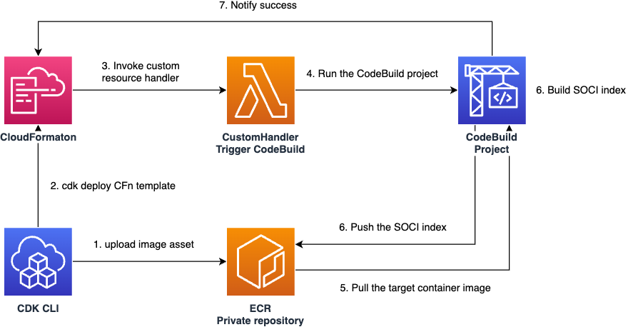

# Deploy-time Build
AWS CDK L3 construct that enables you to build apps during deploy time, aiming to resolve a few problems when we deploy frontend apps from CDK.


## Usage
Install from npm:

```sh
npm i deploy-time-build
```
### Build Node.js apps
Use the following code to build Node.js apps like React frontend:

```ts
import { NodejsBuild } from 'deploy-time-build';

declare const api: apigateway.RestApi;
declare const destinationBucket: s3.IBucket;
declare const distribution: cloudfront.IDistribution;
new NodejsBuild(this, 'ExampleBuild', {
    assets: [
        {
            path: 'example-app',
            exclude: ['dist', 'node_modules'],
        },
    ],
    destinationBucket,
    distribution,
    outputSourceDirectory: 'dist',
    buildCommands: ['npm ci', 'npm run build'],
    buildEnvironment: {
        VITE_API_ENDPOINT: api.url,
    },
});
```

Note that it is possible to pass environment variable `VITE_API_ENDPOINT: api.url` to the construct, which is resolved on deploy time, and injected to the build environment (a vite process in this case.)
The resulting build artifacts will be deployed to `destinationBucket` using a [`s3-deployment.BucketDeployment`](https://docs.aws.amazon.com/cdk/api/v2/docs/aws-cdk-lib.aws_s3_deployment.BucketDeployment.html) construct.

You can specify multiple input assets by `assets` property. These assets are extracted to respective sub directories. For example, assume you specified assets like the following:

```ts
assets: [
    {
        // directory containing source code and package.json
        path: 'example-app',
        exclude: ['dist', 'node_modules'],
        commands: ['npm install'],
    },
    {
        // directory that is also required for the build
        path: 'module1',
    },
],
```

Then, the extracted directories will be located as the following:

```sh
.                         # a temporary directory (automatically created)
├── example-app           # extracted example-app assets
│   ├── src/              # dist or node_modules directories are excluded even if they exist locally.
│   ├── package.json      # npm install will be executed since its specified in `commands` property.
│   └── package-lock.json
└── module1               # extracted module1 assets
```

You can also override the path where assets are extracted by `extractPath` property for each asset.

Please also check [the example directory](./example/) for a complete example.

#### Allowing access from the build environment to other AWS resources
Since `NodejsBuild` construct implements [`iam.IGrantable`](https://docs.aws.amazon.com/cdk/api/v2/docs/aws-cdk-lib.aws_iam.IGrantable.html) interface, you can use `grant*` method of other constructs to allow access from the build environment.

```ts
declare const someBucket: s3.IBucket;
declare const build: NodejsBuild;
someBucket.grantReadWrite(build);
```

You can also use [`iam.Grant`](https://docs.aws.amazon.com/cdk/api/v2/docs/aws-cdk-lib.aws_iam.Grant.html) class to allow any actions and resources.

```ts
declare const build: NodejsBuild;
iam.Grant.addToPrincipal({ grantee: build, actions: ['s3:ListBucket'], resources:['*'] })
```

### Build SOCI index for a container image
[Seekable OCI (SOCI)](https://docs.aws.amazon.com/AmazonECS/latest/userguide/container-considerations.html) is a way to help start tasks faster for Amazon ECS tasks on Fargate 1.4.0. You can build and push a SOCI index to use the feature by the following CDK code:

```ts
import { SociIndexBuild } from 'deploy-time-build;

const asset = new DockerImageAsset(this, 'Image', { directory: 'example-image' });
new SociIndexBuild(this, 'Index', { imageTag: asset.assetHash, repository: asset.repository });
// or using a utility method
SociIndexBuild.fromDockerImageAsset(this, 'Index2', asset);

// Use the asset for ECS Fargate tasks
import { AssetImage } from 'aws-cdk-lib/aws-ecs';
const assetImage = AssetImage.fromDockerImageAsset(asset);
```

The below image is the architecture for `SociIndexBuild` construct. We currently use [`soci-wrapper`](https://github.com/tmokmss/soci-wrapper) to build and push SOCI indices.



## Motivation - why do we need the `NodejsBuild` construct?
I talked about why this construct can be useful in some situations at CDK Day 2023. See the recording or slides below:

[Recording](https://www.youtube.com/live/b-nSH18gFQk?si=ogEZ2x1NixOj6J6j&t=373) | [Slides](https://speakerdeck.com/tmokmss/deploy-web-frontend-apps-with-aws-cdk)

## Considerations
Since this construct builds your frontend apps every time you deploy the stack and there is any change in input assets (and currently there's even no build cache in the Lambda function!), the time a deployment takes tends to be longer (e.g. a few minutes even for the simple app in `example` directory.) This might results in worse developer experience if you want to deploy changes frequently (imagine `cdk watch` deployment always re-build your frontend app).

To mitigate this issue, you can separate the stack for frontend construct from other stacks especially for a dev environment. Another solution would be to set a fixed string as an asset hash, and avoid builds on every deployment.

```ts
      assets: [
        {
          path: '../frontend',
          exclude: ['node_modules', 'dist'],
          commands: ['npm ci'],
          // Set a fixed string as a asset hash to prevent deploying changes.
          // This can be useful for an environment you use to develop locally.
          assetHash: 'frontend_asset',
        },
      ],
```

## Development
Commands for maintainers:

```sh
# run test locally
yarn tsc -p tsconfig.dev.json
yarn integ-runner
yarn integ-runner --update-on-failed
```

# API Reference <a name="API Reference" id="api-reference"></a>

## Constructs <a name="Constructs" id="Constructs"></a>

### NodejsBuild <a name="NodejsBuild" id="deploy-time-build.NodejsBuild"></a>

- *Implements:* aws-cdk-lib.aws_iam.IGrantable

Build Node.js app and optionally publish the artifact to an S3 bucket.

#### Initializers <a name="Initializers" id="deploy-time-build.NodejsBuild.Initializer"></a>

```typescript
import { NodejsBuild } from 'deploy-time-build'

new NodejsBuild(scope: Construct, id: string, props: NodejsBuildProps)
```

| **Name** | **Type** | **Description** |
| --- | --- | --- |
| <code><a href="#deploy-time-build.NodejsBuild.Initializer.parameter.scope">scope</a></code> | <code>constructs.Construct</code> | *No description.* |
| <code><a href="#deploy-time-build.NodejsBuild.Initializer.parameter.id">id</a></code> | <code>string</code> | *No description.* |
| <code><a href="#deploy-time-build.NodejsBuild.Initializer.parameter.props">props</a></code> | <code><a href="#deploy-time-build.NodejsBuildProps">NodejsBuildProps</a></code> | *No description.* |

---

##### `scope`<sup>Required</sup> <a name="scope" id="deploy-time-build.NodejsBuild.Initializer.parameter.scope"></a>

- *Type:* constructs.Construct

---

##### `id`<sup>Required</sup> <a name="id" id="deploy-time-build.NodejsBuild.Initializer.parameter.id"></a>

- *Type:* string

---

##### `props`<sup>Required</sup> <a name="props" id="deploy-time-build.NodejsBuild.Initializer.parameter.props"></a>

- *Type:* <a href="#deploy-time-build.NodejsBuildProps">NodejsBuildProps</a>

---

#### Methods <a name="Methods" id="Methods"></a>

| **Name** | **Description** |
| --- | --- |
| <code><a href="#deploy-time-build.NodejsBuild.toString">toString</a></code> | Returns a string representation of this construct. |

---

##### `toString` <a name="toString" id="deploy-time-build.NodejsBuild.toString"></a>

```typescript
public toString(): string
```

Returns a string representation of this construct.

#### Static Functions <a name="Static Functions" id="Static Functions"></a>

| **Name** | **Description** |
| --- | --- |
| <code><a href="#deploy-time-build.NodejsBuild.isConstruct">isConstruct</a></code> | Checks if `x` is a construct. |

---

##### ~~`isConstruct`~~ <a name="isConstruct" id="deploy-time-build.NodejsBuild.isConstruct"></a>

```typescript
import { NodejsBuild } from 'deploy-time-build'

NodejsBuild.isConstruct(x: any)
```

Checks if `x` is a construct.

###### `x`<sup>Required</sup> <a name="x" id="deploy-time-build.NodejsBuild.isConstruct.parameter.x"></a>

- *Type:* any

Any object.

---

#### Properties <a name="Properties" id="Properties"></a>

| **Name** | **Type** | **Description** |
| --- | --- | --- |
| <code><a href="#deploy-time-build.NodejsBuild.property.node">node</a></code> | <code>constructs.Node</code> | The tree node. |
| <code><a href="#deploy-time-build.NodejsBuild.property.grantPrincipal">grantPrincipal</a></code> | <code>aws-cdk-lib.aws_iam.IPrincipal</code> | The principal to grant permissions to. |

---

##### `node`<sup>Required</sup> <a name="node" id="deploy-time-build.NodejsBuild.property.node"></a>

```typescript
public readonly node: Node;
```

- *Type:* constructs.Node

The tree node.

---

##### `grantPrincipal`<sup>Required</sup> <a name="grantPrincipal" id="deploy-time-build.NodejsBuild.property.grantPrincipal"></a>

```typescript
public readonly grantPrincipal: IPrincipal;
```

- *Type:* aws-cdk-lib.aws_iam.IPrincipal

The principal to grant permissions to.

---


### SociIndexBuild <a name="SociIndexBuild" id="deploy-time-build.SociIndexBuild"></a>

Build and publish a SOCI index for a container image.

A SOCI index helps start Fargate tasks faster in some cases.
Please read the following document for more details: https://docs.aws.amazon.com/AmazonECS/latest/userguide/container-considerations.html

#### Initializers <a name="Initializers" id="deploy-time-build.SociIndexBuild.Initializer"></a>

```typescript
import { SociIndexBuild } from 'deploy-time-build'

new SociIndexBuild(scope: Construct, id: string, props: SociIndexBuildProps)
```

| **Name** | **Type** | **Description** |
| --- | --- | --- |
| <code><a href="#deploy-time-build.SociIndexBuild.Initializer.parameter.scope">scope</a></code> | <code>constructs.Construct</code> | *No description.* |
| <code><a href="#deploy-time-build.SociIndexBuild.Initializer.parameter.id">id</a></code> | <code>string</code> | *No description.* |
| <code><a href="#deploy-time-build.SociIndexBuild.Initializer.parameter.props">props</a></code> | <code><a href="#deploy-time-build.SociIndexBuildProps">SociIndexBuildProps</a></code> | *No description.* |

---

##### `scope`<sup>Required</sup> <a name="scope" id="deploy-time-build.SociIndexBuild.Initializer.parameter.scope"></a>

- *Type:* constructs.Construct

---

##### `id`<sup>Required</sup> <a name="id" id="deploy-time-build.SociIndexBuild.Initializer.parameter.id"></a>

- *Type:* string

---

##### `props`<sup>Required</sup> <a name="props" id="deploy-time-build.SociIndexBuild.Initializer.parameter.props"></a>

- *Type:* <a href="#deploy-time-build.SociIndexBuildProps">SociIndexBuildProps</a>

---

#### Methods <a name="Methods" id="Methods"></a>

| **Name** | **Description** |
| --- | --- |
| <code><a href="#deploy-time-build.SociIndexBuild.toString">toString</a></code> | Returns a string representation of this construct. |

---

##### `toString` <a name="toString" id="deploy-time-build.SociIndexBuild.toString"></a>

```typescript
public toString(): string
```

Returns a string representation of this construct.

#### Static Functions <a name="Static Functions" id="Static Functions"></a>

| **Name** | **Description** |
| --- | --- |
| <code><a href="#deploy-time-build.SociIndexBuild.isConstruct">isConstruct</a></code> | Checks if `x` is a construct. |
| <code><a href="#deploy-time-build.SociIndexBuild.fromDockerImageAsset">fromDockerImageAsset</a></code> | A utility method to create a SociIndexBuild construct from a DockerImageAsset instance. |

---

##### ~~`isConstruct`~~ <a name="isConstruct" id="deploy-time-build.SociIndexBuild.isConstruct"></a>

```typescript
import { SociIndexBuild } from 'deploy-time-build'

SociIndexBuild.isConstruct(x: any)
```

Checks if `x` is a construct.

###### `x`<sup>Required</sup> <a name="x" id="deploy-time-build.SociIndexBuild.isConstruct.parameter.x"></a>

- *Type:* any

Any object.

---

##### `fromDockerImageAsset` <a name="fromDockerImageAsset" id="deploy-time-build.SociIndexBuild.fromDockerImageAsset"></a>

```typescript
import { SociIndexBuild } from 'deploy-time-build'

SociIndexBuild.fromDockerImageAsset(scope: Construct, id: string, imageAsset: DockerImageAsset)
```

A utility method to create a SociIndexBuild construct from a DockerImageAsset instance.

###### `scope`<sup>Required</sup> <a name="scope" id="deploy-time-build.SociIndexBuild.fromDockerImageAsset.parameter.scope"></a>

- *Type:* constructs.Construct

---

###### `id`<sup>Required</sup> <a name="id" id="deploy-time-build.SociIndexBuild.fromDockerImageAsset.parameter.id"></a>

- *Type:* string

---

###### `imageAsset`<sup>Required</sup> <a name="imageAsset" id="deploy-time-build.SociIndexBuild.fromDockerImageAsset.parameter.imageAsset"></a>

- *Type:* aws-cdk-lib.aws_ecr_assets.DockerImageAsset

---

#### Properties <a name="Properties" id="Properties"></a>

| **Name** | **Type** | **Description** |
| --- | --- | --- |
| <code><a href="#deploy-time-build.SociIndexBuild.property.node">node</a></code> | <code>constructs.Node</code> | The tree node. |

---

##### `node`<sup>Required</sup> <a name="node" id="deploy-time-build.SociIndexBuild.property.node"></a>

```typescript
public readonly node: Node;
```

- *Type:* constructs.Node

The tree node.

---


## Structs <a name="Structs" id="Structs"></a>

### AssetConfig <a name="AssetConfig" id="deploy-time-build.AssetConfig"></a>

#### Initializer <a name="Initializer" id="deploy-time-build.AssetConfig.Initializer"></a>

```typescript
import { AssetConfig } from 'deploy-time-build'

const assetConfig: AssetConfig = { ... }
```

#### Properties <a name="Properties" id="Properties"></a>

| **Name** | **Type** | **Description** |
| --- | --- | --- |
| <code><a href="#deploy-time-build.AssetConfig.property.assetHash">assetHash</a></code> | <code>string</code> | Specify a custom hash for this asset. |
| <code><a href="#deploy-time-build.AssetConfig.property.assetHashType">assetHashType</a></code> | <code>aws-cdk-lib.AssetHashType</code> | Specifies the type of hash to calculate for this asset. |
| <code><a href="#deploy-time-build.AssetConfig.property.bundling">bundling</a></code> | <code>aws-cdk-lib.BundlingOptions</code> | Bundle the asset by executing a command in a Docker container or a custom bundling provider. |
| <code><a href="#deploy-time-build.AssetConfig.property.exclude">exclude</a></code> | <code>string[]</code> | File paths matching the patterns will be excluded. |
| <code><a href="#deploy-time-build.AssetConfig.property.followSymlinks">followSymlinks</a></code> | <code>aws-cdk-lib.SymlinkFollowMode</code> | A strategy for how to handle symlinks. |
| <code><a href="#deploy-time-build.AssetConfig.property.ignoreMode">ignoreMode</a></code> | <code>aws-cdk-lib.IgnoreMode</code> | The ignore behavior to use for `exclude` patterns. |
| <code><a href="#deploy-time-build.AssetConfig.property.readers">readers</a></code> | <code>aws-cdk-lib.aws_iam.IGrantable[]</code> | A list of principals that should be able to read this asset from S3. |
| <code><a href="#deploy-time-build.AssetConfig.property.path">path</a></code> | <code>string</code> | The disk location of the asset. |
| <code><a href="#deploy-time-build.AssetConfig.property.commands">commands</a></code> | <code>string[]</code> | Shell commands executed right after the asset zip is extracted to the build environment. |
| <code><a href="#deploy-time-build.AssetConfig.property.extractPath">extractPath</a></code> | <code>string</code> | Relative path from a build directory to the directory where the asset is extracted. |

---

##### `assetHash`<sup>Optional</sup> <a name="assetHash" id="deploy-time-build.AssetConfig.property.assetHash"></a>

```typescript
public readonly assetHash: string;
```

- *Type:* string
- *Default:* based on `assetHashType`

Specify a custom hash for this asset.

If `assetHashType` is set it must
be set to `AssetHashType.CUSTOM`. For consistency, this custom hash will
be SHA256 hashed and encoded as hex. The resulting hash will be the asset
hash.

NOTE: the hash is used in order to identify a specific revision of the asset, and
used for optimizing and caching deployment activities related to this asset such as
packaging, uploading to Amazon S3, etc. If you chose to customize the hash, you will
need to make sure it is updated every time the asset changes, or otherwise it is
possible that some deployments will not be invalidated.

---

##### `assetHashType`<sup>Optional</sup> <a name="assetHashType" id="deploy-time-build.AssetConfig.property.assetHashType"></a>

```typescript
public readonly assetHashType: AssetHashType;
```

- *Type:* aws-cdk-lib.AssetHashType
- *Default:* the default is `AssetHashType.SOURCE`, but if `assetHash` is explicitly specified this value defaults to `AssetHashType.CUSTOM`.

Specifies the type of hash to calculate for this asset.

If `assetHash` is configured, this option must be `undefined` or
`AssetHashType.CUSTOM`.

---

##### `bundling`<sup>Optional</sup> <a name="bundling" id="deploy-time-build.AssetConfig.property.bundling"></a>

```typescript
public readonly bundling: BundlingOptions;
```

- *Type:* aws-cdk-lib.BundlingOptions
- *Default:* uploaded as-is to S3 if the asset is a regular file or a .zip file, archived into a .zip file and uploaded to S3 otherwise

Bundle the asset by executing a command in a Docker container or a custom bundling provider.

The asset path will be mounted at `/asset-input`. The Docker
container is responsible for putting content at `/asset-output`.
The content at `/asset-output` will be zipped and used as the
final asset.

---

##### `exclude`<sup>Optional</sup> <a name="exclude" id="deploy-time-build.AssetConfig.property.exclude"></a>

```typescript
public readonly exclude: string[];
```

- *Type:* string[]
- *Default:* nothing is excluded

File paths matching the patterns will be excluded.

See `ignoreMode` to set the matching behavior.
Has no effect on Assets bundled using the `bundling` property.

---

##### `followSymlinks`<sup>Optional</sup> <a name="followSymlinks" id="deploy-time-build.AssetConfig.property.followSymlinks"></a>

```typescript
public readonly followSymlinks: SymlinkFollowMode;
```

- *Type:* aws-cdk-lib.SymlinkFollowMode
- *Default:* SymlinkFollowMode.NEVER

A strategy for how to handle symlinks.

---

##### `ignoreMode`<sup>Optional</sup> <a name="ignoreMode" id="deploy-time-build.AssetConfig.property.ignoreMode"></a>

```typescript
public readonly ignoreMode: IgnoreMode;
```

- *Type:* aws-cdk-lib.IgnoreMode
- *Default:* IgnoreMode.GLOB

The ignore behavior to use for `exclude` patterns.

---

##### `readers`<sup>Optional</sup> <a name="readers" id="deploy-time-build.AssetConfig.property.readers"></a>

```typescript
public readonly readers: IGrantable[];
```

- *Type:* aws-cdk-lib.aws_iam.IGrantable[]
- *Default:* No principals that can read file asset.

A list of principals that should be able to read this asset from S3.

You can use `asset.grantRead(principal)` to grant read permissions later.

---

##### `path`<sup>Required</sup> <a name="path" id="deploy-time-build.AssetConfig.property.path"></a>

```typescript
public readonly path: string;
```

- *Type:* string

The disk location of the asset.

The path should refer to one of the following:
- A regular file or a .zip file, in which case the file will be uploaded as-is to S3.
- A directory, in which case it will be archived into a .zip file and uploaded to S3.

---

##### `commands`<sup>Optional</sup> <a name="commands" id="deploy-time-build.AssetConfig.property.commands"></a>

```typescript
public readonly commands: string[];
```

- *Type:* string[]
- *Default:* No command is executed.

Shell commands executed right after the asset zip is extracted to the build environment.

---

##### `extractPath`<sup>Optional</sup> <a name="extractPath" id="deploy-time-build.AssetConfig.property.extractPath"></a>

```typescript
public readonly extractPath: string;
```

- *Type:* string
- *Default:* basename of the asset path.

Relative path from a build directory to the directory where the asset is extracted.

---

### NodejsBuildProps <a name="NodejsBuildProps" id="deploy-time-build.NodejsBuildProps"></a>

#### Initializer <a name="Initializer" id="deploy-time-build.NodejsBuildProps.Initializer"></a>

```typescript
import { NodejsBuildProps } from 'deploy-time-build'

const nodejsBuildProps: NodejsBuildProps = { ... }
```

#### Properties <a name="Properties" id="Properties"></a>

| **Name** | **Type** | **Description** |
| --- | --- | --- |
| <code><a href="#deploy-time-build.NodejsBuildProps.property.assets">assets</a></code> | <code><a href="#deploy-time-build.AssetConfig">AssetConfig</a>[]</code> | The AssetProps from which s3-assets are created and copied to the build environment. |
| <code><a href="#deploy-time-build.NodejsBuildProps.property.destinationBucket">destinationBucket</a></code> | <code>aws-cdk-lib.aws_s3.IBucket</code> | S3 Bucket to which your build artifacts are finally deployed. |
| <code><a href="#deploy-time-build.NodejsBuildProps.property.outputSourceDirectory">outputSourceDirectory</a></code> | <code>string</code> | Relative path from the working directory to the directory where the build artifacts are output. |
| <code><a href="#deploy-time-build.NodejsBuildProps.property.buildCommands">buildCommands</a></code> | <code>string[]</code> | Shell commands to build your project. |
| <code><a href="#deploy-time-build.NodejsBuildProps.property.buildEnvironment">buildEnvironment</a></code> | <code>{[ key: string ]: string}</code> | Environment variables injected to the build environment. |
| <code><a href="#deploy-time-build.NodejsBuildProps.property.destinationKeyPrefix">destinationKeyPrefix</a></code> | <code>string</code> | Key prefix to deploy your build artifact. |
| <code><a href="#deploy-time-build.NodejsBuildProps.property.distribution">distribution</a></code> | <code>aws-cdk-lib.aws_cloudfront.IDistribution</code> | The distribution you are using to publish you build artifact. |
| <code><a href="#deploy-time-build.NodejsBuildProps.property.nodejsVersion">nodejsVersion</a></code> | <code>number</code> | The version of Node.js to use in a build environment. Available versions: 12, 14, 16, 18, 20. |
| <code><a href="#deploy-time-build.NodejsBuildProps.property.workingDirectory">workingDirectory</a></code> | <code>string</code> | Relative path from the build directory to the directory where build commands run. |

---

##### `assets`<sup>Required</sup> <a name="assets" id="deploy-time-build.NodejsBuildProps.property.assets"></a>

```typescript
public readonly assets: AssetConfig[];
```

- *Type:* <a href="#deploy-time-build.AssetConfig">AssetConfig</a>[]

The AssetProps from which s3-assets are created and copied to the build environment.

---

##### `destinationBucket`<sup>Required</sup> <a name="destinationBucket" id="deploy-time-build.NodejsBuildProps.property.destinationBucket"></a>

```typescript
public readonly destinationBucket: IBucket;
```

- *Type:* aws-cdk-lib.aws_s3.IBucket

S3 Bucket to which your build artifacts are finally deployed.

---

##### `outputSourceDirectory`<sup>Required</sup> <a name="outputSourceDirectory" id="deploy-time-build.NodejsBuildProps.property.outputSourceDirectory"></a>

```typescript
public readonly outputSourceDirectory: string;
```

- *Type:* string

Relative path from the working directory to the directory where the build artifacts are output.

---

##### `buildCommands`<sup>Optional</sup> <a name="buildCommands" id="deploy-time-build.NodejsBuildProps.property.buildCommands"></a>

```typescript
public readonly buildCommands: string[];
```

- *Type:* string[]
- *Default:* ['npm run build']

Shell commands to build your project.

They are executed on the working directory you specified.

---

##### `buildEnvironment`<sup>Optional</sup> <a name="buildEnvironment" id="deploy-time-build.NodejsBuildProps.property.buildEnvironment"></a>

```typescript
public readonly buildEnvironment: {[ key: string ]: string};
```

- *Type:* {[ key: string ]: string}
- *Default:* {}

Environment variables injected to the build environment.

You can use CDK deploy-time values as well as literals.

---

##### `destinationKeyPrefix`<sup>Optional</sup> <a name="destinationKeyPrefix" id="deploy-time-build.NodejsBuildProps.property.destinationKeyPrefix"></a>

```typescript
public readonly destinationKeyPrefix: string;
```

- *Type:* string
- *Default:* '/'

Key prefix to deploy your build artifact.

---

##### `distribution`<sup>Optional</sup> <a name="distribution" id="deploy-time-build.NodejsBuildProps.property.distribution"></a>

```typescript
public readonly distribution: IDistribution;
```

- *Type:* aws-cdk-lib.aws_cloudfront.IDistribution
- *Default:* No distribution

The distribution you are using to publish you build artifact.

If any specified, the caches are invalidated on new artifact deployments.

---

##### `nodejsVersion`<sup>Optional</sup> <a name="nodejsVersion" id="deploy-time-build.NodejsBuildProps.property.nodejsVersion"></a>

```typescript
public readonly nodejsVersion: number;
```

- *Type:* number
- *Default:* 18

The version of Node.js to use in a build environment. Available versions: 12, 14, 16, 18, 20.

---

##### `workingDirectory`<sup>Optional</sup> <a name="workingDirectory" id="deploy-time-build.NodejsBuildProps.property.workingDirectory"></a>

```typescript
public readonly workingDirectory: string;
```

- *Type:* string
- *Default:* assetProps[0].extractPath

Relative path from the build directory to the directory where build commands run.

---

### SociIndexBuildProps <a name="SociIndexBuildProps" id="deploy-time-build.SociIndexBuildProps"></a>

#### Initializer <a name="Initializer" id="deploy-time-build.SociIndexBuildProps.Initializer"></a>

```typescript
import { SociIndexBuildProps } from 'deploy-time-build'

const sociIndexBuildProps: SociIndexBuildProps = { ... }
```

#### Properties <a name="Properties" id="Properties"></a>

| **Name** | **Type** | **Description** |
| --- | --- | --- |
| <code><a href="#deploy-time-build.SociIndexBuildProps.property.imageTag">imageTag</a></code> | <code>string</code> | The tag of the container image you want to build index for. |
| <code><a href="#deploy-time-build.SociIndexBuildProps.property.repository">repository</a></code> | <code>aws-cdk-lib.aws_ecr.IRepository</code> | The ECR repository your container image is stored. |

---

##### `imageTag`<sup>Required</sup> <a name="imageTag" id="deploy-time-build.SociIndexBuildProps.property.imageTag"></a>

```typescript
public readonly imageTag: string;
```

- *Type:* string

The tag of the container image you want to build index for.

---

##### `repository`<sup>Required</sup> <a name="repository" id="deploy-time-build.SociIndexBuildProps.property.repository"></a>

```typescript
public readonly repository: IRepository;
```

- *Type:* aws-cdk-lib.aws_ecr.IRepository

The ECR repository your container image is stored.

You can only specify a repository in the same environment (account/region).
The index artifact will be uploaded to this repository.

---


