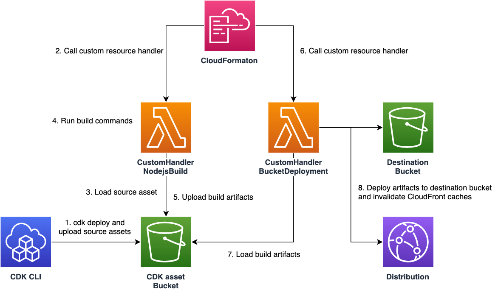

# Deploy-time Build
AWS CDK L3 construct that enables you to build apps during deploy time, aiming to resolve a few problems when we deploy frontend apps from CDK.



## Usage
Install from npm:

```sh
npm i deploy-time-build
```
### Build Node.js apps
Use the following code to build Node.js apps like React frontend:

```ts
import { NodejsBuild } from 'deploy-time-build';

declare const api: apigateway.RestApi;
declare const destinationBucket: s3.IBucket;
declare const distribution: cloudfront.IDistribution;
new NodejsBuild(this, 'ExampleBuild', {
    assets: [
        {
            path: 'example-app',
            exclude: ['dist', 'node_modules'],
        },
    ],
    destinationBucket,
    distribution,
    outputSourceDirectory: 'dist',
    buildCommands: ['npm ci', 'npm run build'],
    buildEnvironment: {
        VITE_API_ENDPOINT: api.url,
    },
});
```

Note that it is possible to pass environment variable `VITE_API_ENDPOINT: api.url` to the construct, which is resolved on deploy time, and injected to the build environment (a vite process in this case.)
The resulting build artifacts will be deployed to `destinationBucket` using a [`s3-deployment.BucketDeployment`](https://docs.aws.amazon.com/cdk/api/v2/docs/aws-cdk-lib.aws_s3_deployment.BucketDeployment.html) construct.

You can specify multiple input assets by `assets` property. These assets are extracted to respective sub directories. For example, assume you specified assets like the following:

```ts
assets: [
    {
        // directory containing source code and package.json
        path: 'example-app',
        exclude: ['dist', 'node_modules'],
        commands: ['npm install'],
    },
    {
        // directory that is also required for the build
        path: 'module1',
    },
],
```

Then, the extracted directories will be located as the following:

```sh
.                         # a temporary directory (automatically created)
├── example-app           # extracted example-app assets
│   ├── src/              # dist or node_modules directories are excluded even if they exist locally.
│   ├── package.json      # npm install will be executed since its specified in `commands` property.
│   └── package-lock.json
└── module1               # extracted module1 assets
```

You can also override the path where assets are extracted by `extractPath` property for each asset.

Please also check [the example directory](./example/) for a complete example. 

### Build SOCI index for a container image
[Seekable OCI (SOCI)](https://docs.aws.amazon.com/AmazonECS/latest/userguide/container-considerations.html) is a way to help start tasks faster for Amazon ECS tasks on Fargate 1.4.0. You can build and push a SOCI index to use the feature by the following CDK code:

```ts
import { SociIndexBuild } from 'deploy-time-build;

const asset = new DockerImageAsset(this, 'Image', { directory: 'example-image' });
new SociIndexBuild(this, 'Index', { imageTag: asset.assetHash, repository: asset.repository });
// or using a utility method
SociIndexBuild.fromDockerImageAsset(this, 'Index2', asset);

// Use the asset for ECS Fargate tasks
import { AssetImage } from 'aws-cdk-lib/aws-ecs';
const assetImage = AssetImage.fromDockerImageAsset(asset);
```

## Motivation - why do we need this construct?
Previously, there are a few different ways to deploy frontend applications from CDK (1 and 2 below). But none is perfect with different pros and cons. This construct adds another option to deploy frontend apps.

### 1. Deploy depending resources first, then build a frontend app and deploy it separately
One common way to deploy apps is the following: deploy depending resources (e.g. backend API or Cognito user pools) first, then get values for frontend (e.g. API endpoint or userPoolId) from stack outputs, and build the frontend locally and deploy it separately.

This pattern is easy to use but there are also some disadvantages:

1. we cannot deploy frontend constructs and depending constructs at once (like in a single stack)
2. we need some manipulation outside of CDK to get values from stack output, and inject them to frontend build process. (e.g. manually copy-pasting the values or run a shell script using CloudFormation API to load values from stacks.)

Especially it is sometimes annoying when you want to keep you CDK app as simple as possible.

### 2. Use `S3Deployment.Source.data` to inject deploy-time values
Another possible way is to use [`s3-deployment.Source.data/jsonData`](https://github.com/aws/aws-cdk/pull/18659), storing deploy-time values in an S3 Bucket as a file and loading it from frontend apps on runtime. 

In this case it is possible to define both frontend and backend in a single stack and deploy them at once. However, it requires another network request for apps to load those values, which is not very efficient and required additional implementation for runtime to support this mechanism. Also, the CDK internal implementation for this feature is relatively complex (it resolves tokens in the construct's own code unlike other constructs) and currently has [cross-stack bugs](https://github.com/aws/aws-cdk/issues/19257) that might be difficult to resolve.

You can see the working example of this pattern [in this repository](https://github.com/aws-samples/nextjs-authentication-ui-using-amplify-ui-with-cognito#deploy-cdk-stacks).

Now, the construct `NodejsBuild` of this package resolves the above disadvantages.

### 3. Deploy-time build
The main problem is that you cannot know the required values (e.g. API endpoint) unless you deploy the resources, and you cannot build and deploy frontend apps unless you know these values. To resolve it, you can build your frontend app during CloudFormation deployment time. By this, you can inject deploy-time values to your frontend build environment, thereby deploying it all at once.

The advantages of this way is:

1. All of the deployment process can be completed inside CDK. No need to use any additional shell script like the pattern #1.
2. The implementation of frontend is CDK agnostic. You can just use environment variables to inject API endpoint, unlike the pattern #2.
3. We can use both single stack strategy as well as multi-stacks strategy, without any complex mechanism like the pattern #2.

There are, however, a few considerations to be discussed when you use this constuct. Please check the next section.

## Considerations
Since this construct builds your frontend apps every time you deploy the stack and there is any change in input assets (and currently there's even no build cache in the Lambda function!), the time a deployment takes tends to be longer (e.g. a few minutes even for the simple app in `example` directory.) This might results in worse developer experience if you want to deploy changes frequently (imagine `cdk watch` deployment always re-build your frontend app).

To mitigate this issue, you can separate the stack for frontend construct from other stacks especially for a dev environment. Another solution would be to set a fixed string as an asset hash, and avoid builds on every deployment.

```ts
      assets: [
        {
          path: '../frontend',
          exclude: ['node_modules', 'dist'],
          commands: ['npm ci'],
          // Set a fixed string as a asset hash to prevent deploying changes.
          // This can be useful for an environment you use to develop locally.
          assetHash: 'frontend_asset',
        },
      ],
```

## Development
Commands for maintainers:

```sh
# run test locally
yarn tsc -p tsconfig.dev.json
yarn integ-runner
yarn integ-runner --update-on-failed
```
