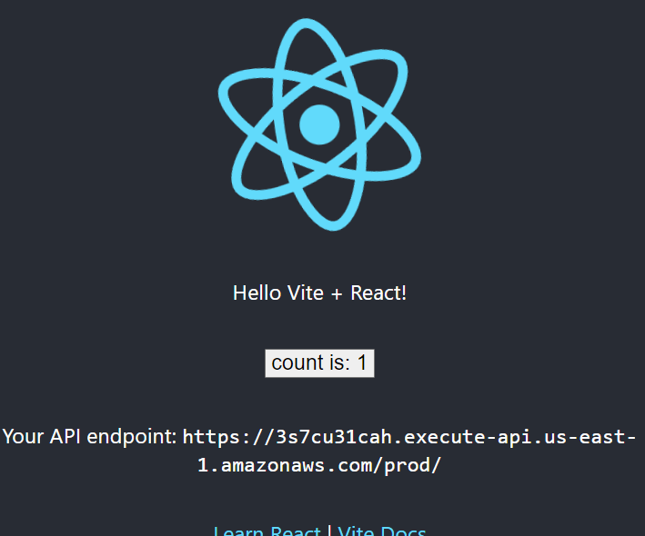

## How to Deploy
```sh
# Assume current directory is the example directory
cd ../lambda/nodejs-build
npm ci
npm run build
cd -
npx cdk deploy NodejsTestStack
```

## Description
After a successful deployment, you will get a CloudFront URL from the stack output.



You can see the API endpoint is successfully injected to the sample frontend app.
